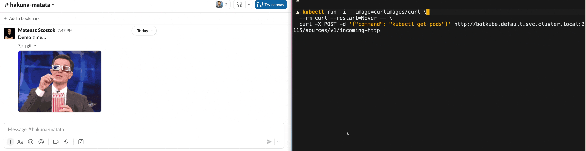

# Botkube Plugins

### `X` executor plugin

The `x` executor plugin allows you to install and run CLIs directly from a chat window (e.g. Slack, Discord) without any hassle. Interactivity in the form of buttons and dropdowns is also supported. It's crucial as you can easily run all your favourite tools against Kubernetes directly from your phone too.

### `gh-comments` source plugin

The `gh-comments` source plugin showcases how to trigger Botkube executors from GitHub comment.

### `incoming-http` source plugin

The `incoming-http` source plugin showcases how you can send the Botkube command over HTTP instead of sending it from a communication platform.

