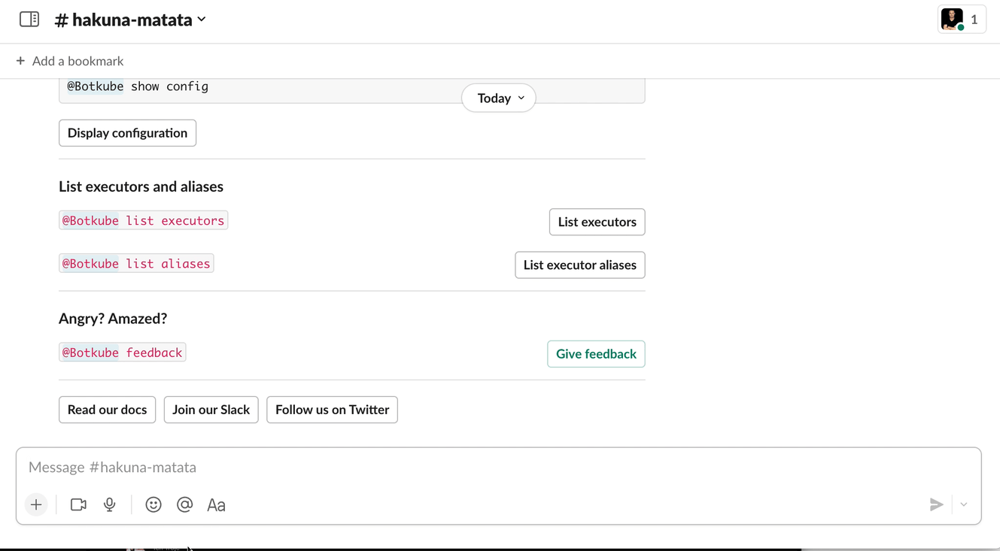

The `x` a.k.a. `exec` executor plugin allows you to install and run CLIs directly from a chat window (e.g. Slack, Discord) without any hassle.

:::tip
Interactivity in the form of buttons and dropdowns is also supported. It's crucial as you can easily run all your favourite tools against Kubernetes directly from your phone too.
:::

# Usage

The x executor plugin has been contributed to the Botkube project and is now available in the official plugin repository. More information about the plugin can be found [here](https://docs.botkube.io/usage/executor/exec).
