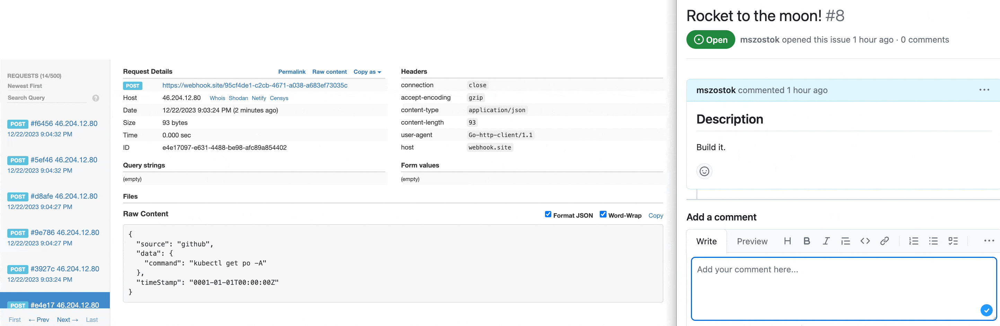

The `gh-comments` source plugin showcases how to trigger Botkube executors from GitHub comment.


The posted comment on the watched repository is parsed; if it matches the prefix, the command is executed, and the output is posted on the configured communication platform channel. In this case, the output was posted on a Slack channel. However, it can be any communication platform that Botkube supports, even outgoing webhook, e.g.:



# Tutorial

## Prerequisites

- Kubernetes cluster (e.g. [k3d](https://k3d.io/))
  :::note
  To start a local cluster, run `k3d cluster create`
  :::

## Steps

1. **(optional)** Obtain the GitHub access token. Instruction for creating a token can be found here: https://help.github.com/articles/creating-a-personal-access-token-for-the-command-line/#creating-a-token.
   This is used to increase the rate limit or watch private repositories. If you don't want to use it, leave the `accessToken` field empty.
   The API that is called is described [here](https://docs.github.com/en/rest/issues/comments?apiVersion=2022-11-28).

2. Create the `config.yaml` configuration file, with the following content:

   ```yaml
   sources:
     "github":
       displayName: "GitHub comment watcher"
       mszostok/gh-comments:
         enabled: true
         config:
           github:
             auth:
               # access token is optional, it is used to increase the rate limit or watch private repositories
               accessToken: ""
           onRepository:
             # The name of the GitHub repository in the form 'owner/repository'.
             # required
             name: "mszostok/gh-test-repo"
             # the interval for rechecking for a new comments on configured repository.
             # default: 5s
             recheckInterval: 5s
             # The interval for rechecking for a new comments on configured repository. If empty, all comments will be processed.
             # default: "#run"
             commentRequiredPrefix: "#run"

   actions:
     "run-commands":
       enabled: true
       displayName: "Run commands from incoming source"
       command: "{{ .Event.command }}"
       bindings:
         sources:
           - github
         executors:
           - k8s-default-tools

   executors:
     k8s-default-tools:
       botkube/kubectl:
         enabled: true
       botkube/helm:
         enabled: true
   settings:
     clusterName: "labs"
   plugins:
     repositories:
       mszostok:
         url: https://github.com/mszostok/botkube-plugins/releases/download/v1.2.0/plugins-index.yaml
   ```

3. Install Botkube with the `config.yaml` configuration file and configured communication platform.

import Tabs from '@theme/Tabs';
import TabItem from '@theme/TabItem';

<div className="tab-container-nested">
<Tabs>
  <TabItem value="webhook" label="Webhook" default>

```bash
helm repo add botkube https://charts.botkube.io
helm repo update

export WEBHOOK_URL={url} # e.g. obtain from https://webhook.site/

helm install botkube botkube/botkube --version v1.7.0 \
-f /tmp/config.yaml \
--set communications.default-group.webhook.enabled=true \
--set communications.default-group.webhook.url=${WEBHOOK_URL} \
--set communications.default-group.webhook.sources={"github"} \
--set image.repository=kubeshop/pr/botkube \
--set image.tag=1341-PR
```

  </TabItem>
  <TabItem value="slack" label="Socket Slack" >

```bash
helm repo add botkube https://charts.botkube.io
helm repo update

export SLACK_CHANNEL_NAME={channel_name} # without '#'
export SLACK_API_APP_TOKEN={token} # starts with 'xapp-1'
export SLACK_API_BOT_TOKEN={token} # starts with 'xoxb-'

helm install botkube botkube/botkube --version v1.7.0 \
-f /tmp/config.yaml \
--set communications.default-group.socketSlack.enabled=true \
--set communications.default-group.socketSlack.channels.default.name=${SLACK_CHANNEL_NAME} \
--set communications.default-group.socketSlack.appToken=${SLACK_API_APP_TOKEN} \
--set communications.default-group.socketSlack.botToken=${SLACK_API_BOT_TOKEN} \
--set communications.default-group.socketSlack.channels.default.bindings.sources={"github"} \
--set 'executors.k8s-default-tools.botkube/kubectl.enabled'=true \
--set 'executors.k8s-default-tools.botkube/helm.enabled'=true
```

  </TabItem>
</Tabs>
For other installation options, see [**Botkube installation**](https://docs.botkube.io/installation) document.
</div>

4. Navigate to configured GitHub repository and add a comment with the prefix `#run` to trigger the command. For example, to run `kubectl get pods` command, add the following comment `#run kubectl get pods` to the issue or pull request.
