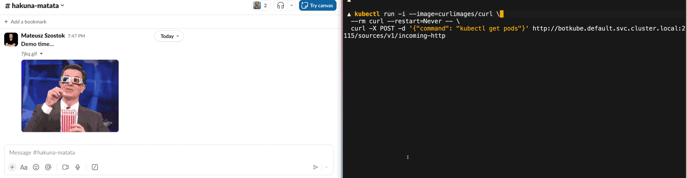
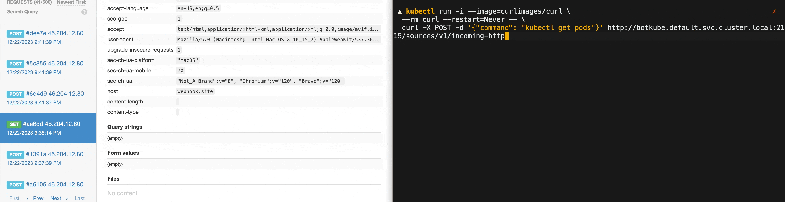

The `incoming-http` source plugin showcases how you can send the Botkube command over HTTP instead of sending it from a communication platform.



The sent command is executed by Botkube, and the output is posted on the configured communication platform channel. In this case, the output was posted on a Slack channel. However, it can be any communication platform that Botkube supports, even outgoing webhook, e.g.:



# Tutorial

## Prerequisites

- Kubernetes cluster (e.g. [k3d](https://k3d.io/))
  :::note
  To start a local cluster, run `k3d cluster create`
  :::

## Steps

1. Create the `config.yaml` configuration file, with the following content:

   ```yaml
   sources:
     "incoming-http":
       displayName: "HTTP incoming source"
       mszostok/incoming-http:
         enabled: true

   actions:
     "run-commands":
       enabled: true
       displayName: "Run commands from incoming source"
       command: "{{ .Event.command }}"
       bindings:
         sources:
           - incoming-http
         executors:
           - k8s-default-tools

   executors:
     k8s-default-tools:
       botkube/kubectl:
         enabled: true
       botkube/helm:
         enabled: true
   settings:
     clusterName: "labs"
   plugins:
     repositories:
       mszostok:
         url: https://github.com/mszostok/botkube-plugins/releases/download/v1.2.0/plugins-index.yaml
   ```

2. Install Botkube with the `config.yaml` configuration file and configured communication platform.

import Tabs from '@theme/Tabs';
import TabItem from '@theme/TabItem';

<div className="tab-container-nested">
<Tabs>
  <TabItem value="webhook" label="Webhook" default>

```bash
helm repo add botkube https://charts.botkube.io
helm repo update

export WEBHOOK_URL={url} # e.g. obtain from https://webhook.site/

helm install botkube botkube/botkube --version v1.7.0 \
-f /tmp/config.yaml \
--set communications.default-group.webhook.enabled=true \
--set communications.default-group.webhook.url=${WEBHOOK_URL} \
--set communications.default-group.webhook.sources={"incoming-http"} \
--set image.repository=kubeshop/pr/botkube \
--set image.tag=1341-PR
```

  </TabItem>
  <TabItem value="slack" label="Socket Slack" >

```bash
helm repo add botkube https://charts.botkube.io
helm repo update

export SLACK_CHANNEL_NAME={channel_name} # without '#'
export SLACK_API_APP_TOKEN={token} # starts with 'xapp-1'
export SLACK_API_BOT_TOKEN={token} # starts with 'xoxb-'

helm install botkube botkube/botkube --version v1.7.0 \
-f /tmp/config.yaml \
--set communications.default-group.socketSlack.enabled=true \
--set communications.default-group.socketSlack.channels.default.name=${SLACK_CHANNEL_NAME} \
--set communications.default-group.socketSlack.appToken=${SLACK_API_APP_TOKEN} \
--set communications.default-group.socketSlack.botToken=${SLACK_API_BOT_TOKEN} \
--set communications.default-group.socketSlack.channels.default.bindings.sources={"incoming-http"} \
--set 'executors.k8s-default-tools.botkube/kubectl.enabled'=true \
--set 'executors.k8s-default-tools.botkube/helm.enabled'=true
```

  </TabItem>
</Tabs>
For other installation options, see [**Botkube installation**](https://docs.botkube.io/installation) document.
</div>

3. To call the endpoint within the cluster, you can use the following command:

   ```bash
   kubectl run -i --image=curlimages/curl \
     --rm curl --restart=Never -- \
     curl -X POST -d '{"command": "kubectl get pods"}' http://botkube.default.svc.cluster.local:2115/sources/v1/incoming-http
   ```

   Otherwise, you need to port-forward the Botkube incoming webhook to your local machine:

   ```bash
   kubectl port-forward svc/botkube 2115:2115
   ```

   and run the following command:

   ```bash
   curl -X POST -d '{"command": "kubectl get pods"}' http://localhost:2115/sources/v1/incoming-http
   ```
